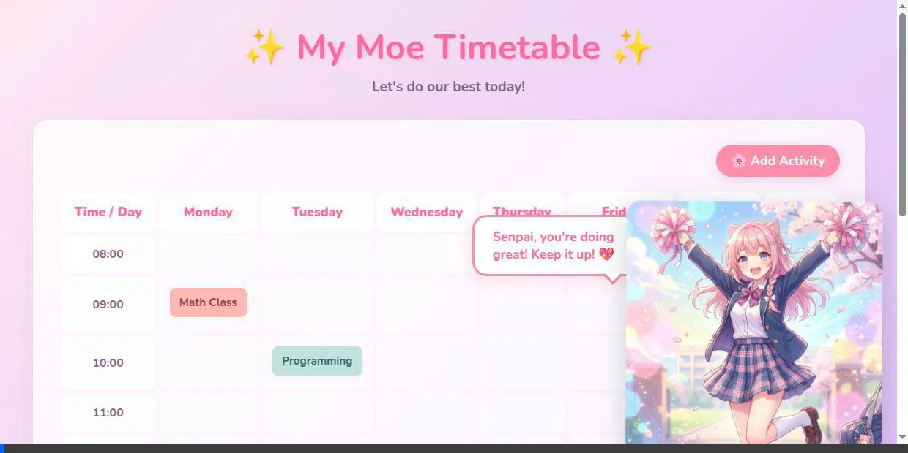

# Moe Timetable ~ Ganbatte! ✨

A motivational, anime-themed timetable website featuring a "moe" anime girl character to help boost your mood and manage your daily schedule. Built with HTML, CSS, and vanilla JS.

## How to Use

1. Click on the **🌸 Add Activity** button.
2. Select the day, time, and activity you want to add.
3. Choose a cute color theme for your activity block.
4. Click **Save** to add it to your beautifully themed timetable!

## Features
- **Kawaii Aesthetics**: Lovely pastel colors, rounded corners, and a fun character to cheer you on.
- **Dynamic Grid**: Weekly view to easily see your upcoming activities.
- **Motivating Messages**: Get cute, randomized motivational quotes to keep your spirits high.

Ganbatte! (Do your best!) 💖
